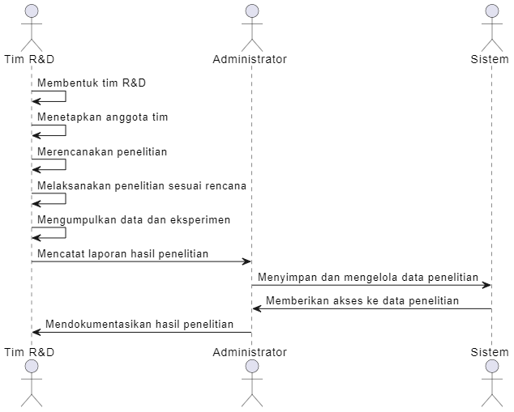

# ANALISIS 


**SAYA MUHAMAD ROHISUL IMAN DENGAN NIM 20230801270 MAKA MENDAPATKAN STUDI KASUS ```Teknologi dan Inovasi```** 


### ```Teknologi dan Inovasi```


**Teknologi** adalah aplikasi pengetahuan ilmiah untuk menciptakan alat, sistem, atau proses yang bertujuan untuk memecahkan masalah dan memenuhi kebutuhan manusia. Teknologi dapat berupa perangkat keras (hardware) seperti komputer dan telepon, atau perangkat lunak (software) seperti aplikasi dan sistem operasi. Teknologi sering kali dihasilkan melalui penelitian dan pengembangan ilmiah.

**Inovasi**, di sisi lain, merujuk pada penerapan ide atau penemuan baru yang membawa perubahan positif, meningkatkan cara sesuatu dilakukan, atau menghasilkan solusi yang lebih efisien atau efektif. Inovasi bisa datang dalam berbagai bentuk, seperti produk baru, proses baru, atau metode baru yang lebih baik dari yang ada sebelumnya. Inovasi juga dapat mengarah pada pengembangan teknologi baru atau aplikasi baru untuk teknologi yang sudah ada

---


# Latar Belakang

Dalam dunia teknologi yang terus berkembang, **penelitian dan pengembangan (R&D)** menjadi kunci utama dalam menciptakan inovasi yang relevan dan berdaya saing. Proses R&D yang efektif memerlukan manajemen yang terstruktur, **mulai dari pembentukan tim**, **pencatatan penelitian yang sedang berlangsung**, **hingga dokumentasi hasil penelitian**. Tanpa sistem yang terorganisir, perusahaan atau institusi sering menghadapi kendala dalam memantau progres penelitian dan mengelola informasi dengan efisien.  

Untuk mengatasi tantangan tersebut, **Sistem Manajemen Penelitian dan Pengembangan Teknologi (R&D)** dikembangkan sebagai solusi dalam mengelola proses penelitian secara sistematis. Sistem ini memungkinkan **pencatatan struktur tim penelitian**, **proyek yang sedang berjalan**, **serta hasil yang telah dicapai**. Dengan adanya sistem ini, perusahaan atau institusi dapat lebih mudah mengawasi perkembangan penelitian, meningkatkan kolaborasi antar anggota tim, dan memastikan bahwa inovasi yang dihasilkan dapat diterapkan secara optimal.  


Maka, analisis ini akan mengangkat tema **"Sistem Manajemen Penelitian dan Pengembangan Teknologi (R&D)"**

## Sistem Manajemen Penelitian dan Pengembangan Teknologi (R&D)


**Sistem Manajemen Penelitian dan Pengembangan (R&D)** adalah sebuah sistem yang dirancang untuk mengelola dan mengatur seluruh proses **penelitian dan pengembangan** (R&D) yang dilakukan oleh sebuah organisasi atau perusahaan, terutama dalam bidang **teknologi**.  Sistem ini bertujuan untuk memastikan bahwa seluruh kegiatan riset dan pengembangan berjalan dengan **lancar, terstruktur, dan efisien**. Hal ini penting karena **R&D berperan krusial dalam menciptakan inovasi** yang mendasari kemajuan teknologi dan memberi perusahaan atau institusi **keunggulan kompetitif**.


## Memahami Konteks Analisis


Ini adalah tentang bagaimana **Sistem Manajemen Penelitian dan Pengembangan Teknologi (R&D)** dirancang untuk **mengelola proses penelitian dan pengembangan** dalam sebuah organisasi.  
Sistem ini bertujuan untuk **memudahkan pengelolaan data penelitian, pengawasan progres, serta pencatatan hasil penelitian yang terstruktur**.  
Dengan menggunakan sistem ini, tim R&D dapat lebih mudah **mengorganisir dan memantau proyek penelitian**, memastikan bahwa setiap langkah penelitian dilakukan dengan **efisien** dan hasil yang dicapai **terdokumentasi dengan baik**.  

 
**Mengapa sistem ini penting?**  
Dalam dunia yang bergerak cepat, terutama dalam bidang **teknologi**, pengelolaan penelitian yang **tidak terstruktur** dapat menyebabkan **keterlambatan, kesalahan data, atau hilangnya informasi penting**.  
Oleh karena itu, dibutuhkan sebuah sistem untuk **mengatasi tantangan tersebut, meningkatkan kolaborasi tim, dan memastikan penelitian dapat dilakukan dengan lebih terorganisir**.  
Dengan adanya **Sistem Manajemen R&D**, perusahaan atau institusi dapat memastikan bahwa proyek penelitian berjalan **dengan lancar, terkoordinasi, dan memiliki hasil yang relevan** untuk pengembangan teknologi.  


**Siapa yang terlibat dalam penggunaan sistem ini?**  
Pengguna utama sistem ini adalah **tim R&D** yang terdiri dari berbagai anggota, seperti **peneliti, pengembang teknologi, dan kepala tim penelitian**.  
Selain itu, **manajer proyek dan administrator** yang mengawasi seluruh kegiatan R&D juga akan berinteraksi dengan sistem ini untuk **memantau kemajuan, mengelola data penelitian, serta membuat keputusan berbasis data**.  


**Di mana sistem ini akan diterapkan?**  
Sebuah Perusahaan **XYZ** menginginkan sistem ini diterapkan di perusahaan mereka. Mereka menyadari pentingnya **pengelolaan proses penelitian yang terstruktur dan efisien** untuk mendukung **inovasi teknologi** yang terus berkembang.

Sistem Manajemen **Penelitian dan Pengembangan Teknologi (R&D)** biasanya diterapkan di **perusahaan atau institusi riset** yang fokus pada **pengembangan teknologi**, seperti:  
- **Perusahaan teknologi**  
- **Lembaga penelitian**  
- **Universitas**  
- **Start-up** yang berfokus pada inovasi produk dan layanan baru  

Dalam hal ini, **perusahaan XYZ** berencana untuk mengimplementasikan sistem ini guna **mengelola seluruh kegiatan R&D internal** mereka yang berkaitan dengan **inovasi produk dan teknologi baru**.  


**Kapan sistem ini mulai diterapkan?**  
Sistem ini biasanya digunakan sejak **awal sebuah proyek penelitian** dimulai dan akan **terus digunakan selama proyek berlangsung**.  
Hal ini memastikan bahwa seluruh **data terkait proyek dapat dipantau dan diperbarui secara real-time**.  
Dengan demikian, proses **R&D dapat diawasi dengan baik sepanjang durasi proyek**, dan setiap perkembangan terbaru dapat segera diketahui oleh seluruh anggota tim.  

 
**Bagaimana sistem ini bekerja?**  
- Sistem ini bekerja dengan **menyimpan semua data penelitian dalam database yang terorganisir**.  
- Setiap penelitian yang dilakukan oleh tim R&D akan **dicatat dalam sistem**, yang kemudian dapat **diakses dan diperbarui secara terintegrasi**.  
- **Progres penelitian akan dilacak** melalui pembaruan status, sehingga  pihak administrator lah yang **Mengelola status dari setiap proyek**.  
- Selain itu, **hasil-hasil penelitian** yang telah dicapai akan **disimpan dan didokumentasikan** untuk referensi di masa mendatang.  


## **Alur Kerja Proses Sistem Manajemen R&D**  

### **Penjelasan**  
Alur Kerja proses dalam **Sistem Manajemen Penelitian dan Pengembangan Teknologi (R&D)** mencakup tahapan utama dalam mengelola proyek penelitian. Sistem ini membantu tim R&D dalam membentuk tim, merencanakan penelitian, melaksanakan eksperimen, serta mendokumentasikan hasil penelitian secara terstruktur. Dengan adanya sistem ini, setiap proses dalam penelitian dapat dipantau dan dikelola dengan lebih efisien.  

Berikut adalah tahapan utama dalam alur penerapan sistem ini:  

---

### **1. Pembentukan Tim R&D**  
- **Tim R&D** membentuk dan menetapkan anggota tim untuk penelitian.  
- **Tim R&D** merencanakan penelitian yang akan dilakukan, termasuk menentukan tujuan, metode, serta sumber daya yang dibutuhkan.  

---

### **2. Pelaksanaan Penelitian**  
- **Tim R&D** melaksanakan penelitian sesuai dengan rencana yang telah disusun, seperti eksperimen dan pengumpulan data.  
- Kemajuan penelitian dicatat oleh **Tim R&D** dan dilaporkan ke **Administrator** untuk pemantauan lebih lanjut.  

---

### **3. Dokumentasi Hasil Penelitian**  
- **Administrator** menyimpan dan mendokumentasikan hasil penelitian dalam sistem.  
- **Administrator** memastikan bahwa data dapat diakses oleh pihak terkait dalam tim untuk keperluan analisis dan pengambilan keputusan lebih lanjut.  

Dengan mengikuti alur ini, sistem manajemen R&D dapat memastikan bahwa penelitian dilakukan dengan cara yang lebih sistematis dan terorganisir. 🚀




---
## Analisis Kebutuhan Sistem

### Teknologi Utama Dalam pengembangan sistem

Untuk membangun **Sistem Manajemen Penelitian dan Pengembangan Teknologi (R&D)**, akan menggunakan beberapa teknologi utama yang dapat mendukung pengembangan sistem yang efisien dan scalable. Teknologi-teknologi ini meliputi:

### 1. **Laravel**
Laravel adalah framework PHP yang sangat populer untuk membangun aplikasi web. Laravel memiliki fitur-fitur yang kuat seperti routing, middleware, otentikasi, dan ORM (Eloquent) untuk bekerja dengan database secara efisien. Dalam sistem ini, Laravel akan digunakan untuk:
- Membangun backend
- Mengelola logika bisnis
- Menangani interaksi dengan database

### 2. **Filament**
Filament adalah paket admin panel untuk Laravel yang memungkinkan pembuatan antarmuka admin yang elegan dan fungsional. Filament sangat berguna untuk mengelola data dalam sistem manajemen, memungkinkan pengguna dengan hak akses yang tepat untuk:
- Memanipulasi dan melihat data penelitian
- Mengelola tim
- Menampilkan hasil penelitian

Dengan Filament, kita dapat mempercepat pembuatan tampilan administrasi tanpa perlu menulis terlalu banyak kode UI.

### 3. **Docker**
Docker digunakan untuk membuat kontainer yang berisi aplikasi dan dependensinya, memastikan bahwa aplikasi ini dapat berjalan dengan konsisten di berbagai lingkungan pengembangan atau produksi. Dengan Docker, kita bisa membuat:
- Lingkungan terisolasi untuk menjalankan Laravel, Filament, dan MySQL
- Menjamin bahwa aplikasi berjalan dengan baik tanpa khawatir tentang ketergantungan lingkungan yang berbeda

### 4. **MySQL**
MySQL adalah sistem manajemen database relasional yang digunakan untuk menyimpan data yang terkait dengan penelitian, tim, dan hasil penelitian. Beberapa data yang disimpan meliputi:
- Informasi tim R&D
- Proyek penelitian yang sedang berlangsung
- Hasil penelitian yang telah dicapai


## Struktur Sistem Manajemen Penelitian dan Pengembangan (R&D)

Dalam sistem manajemen penelitian dan pengembangan (R&D), proses yang terstruktur sangat penting untuk memastikan bahwa kegiatan penelitian berjalan dengan efisien dan produktif. Proses ini dimulai dengan pembentukan tim, pencatatan penelitian yang sedang berlangsung, dan dokumentasi hasil penelitian yang tercapai. Masing-masing langkah ini memiliki peran yang sangat penting untuk keberhasilan keseluruhan proyek R&D.

### 1. **Pembentukan Tim**

Proses pertama dalam penelitian adalah pembentukan tim R&D yang akan terlibat dalam proyek tersebut. Pembentukan tim ini harus memperhatikan keahlian, pengalaman, dan kompetensi setiap anggota untuk memastikan bahwa tim memiliki kemampuan yang diperlukan untuk menyelesaikan tugas-tugas penelitian yang ada. Tim R&D wajib terdiri dari 4 orang yaitu **peneliti, ahli teknologi, analis data, dan kepala tim** yang akan memimpin jalannya penelitian. Pembentukan tim yang baik akan memastikan alokasi sumber daya manusia yang tepat dan memfasilitasi kolaborasi yang efektif antar anggota tim.

Dalam sistem ini, informasi mengenai tim yang dibentuk dapat dicatat dalam tabel **Tim_RnD**, yang akan menyimpan data tentang nama tim, jumlah anggota, serta ketua tim yang memimpin tim tersebut. Berikut adalah contoh struktur tabel yang dibutuhkan:

#### Struktur Tabel **Tim_RnD**:
- **id_tim** (ID unik untuk setiap tim)
- **nama_tim** (Nama tim yang dibentuk)
- **ketua_tim** (Nama ketua tim)
- **peneliti** (Nama peneliti dalam tim)
- **ahli_teknologi** (Nama ahli teknologi dalam tim)
- **analis_data** (Nama analis data dalam tim)

### 2. **Pencatatan Penelitian yang Sedang Berlangsung**

Setelah tim terbentuk, langkah berikutnya adalah memulai proyek penelitian yang akan dikelola oleh tim tersebut. Pencatatan proyek penelitian yang sedang berlangsung sangat penting untuk memastikan bahwa setiap kegiatan dapat dipantau dengan mudah. Pencatatan ini mencakup informasi tentang judul penelitian, bidang penelitian, serta tim yang bertanggung jawab atas proyek tersebut.

Untuk memudahkan pencatatan ini, informasi mengenai proyek penelitian yang sedang berlangsung dapat disimpan dalam tabel **Penelitian**. Tabel ini akan menghubungkan penelitian dengan tim yang bertanggung jawab serta memberikan informasi penting mengenai status penelitian. Struktur tabel **Penelitian** adalah sebagai berikut:

#### Struktur Tabel **Penelitian**:
- **id_penelitian** (ID unik untuk setiap penelitian)
- **judul** (Judul dari penelitian yang sedang dilakukan)
- **bidang** (Bidang atau topik penelitian)
- **id_tim** (ID tim yang bertanggung jawab, yang berhubungan dengan tabel **Tim_RnD**)

### 3. **Dokumentasi Hasil Penelitian**

Langkah terakhir adalah mendokumentasikan hasil dari penelitian yang telah selesai. Dokumentasi hasil penelitian ini mencakup deskripsi dari hasil yang dicapai dan tanggal selesai penelitian. Hasil penelitian yang terdokumentasi dengan baik tidak hanya memberikan informasi yang berguna bagi tim dan organisasi, tetapi juga menjadi referensi yang penting untuk penelitian di masa mendatang.

Untuk mencatat hasil penelitian yang telah selesai, informasi ini dapat dimasukkan ke dalam tabel **Hasil_Penelitian**. Tabel ini akan menyimpan hasil-hasil penelitian yang telah dicapai oleh tim R&D. Berikut adalah struktur tabel yang diperlukan untuk mendokumentasikan hasil penelitian:

#### Struktur Tabel **Hasil_Penelitian**:
- **id_hasil** (ID unik untuk setiap hasil penelitian)
- **id_penelitian** (ID penelitian yang hasilnya didokumentasikan, yang berhubungan dengan tabel **Penelitian**)
- **deskripsi** (Deskripsi hasil yang dicapai dari penelitian)
- **tanggal_selesai** (Tanggal penelitian selesai dan hasilnya didokumentasikan)

## **Tabel dalam Sistem Manajemen R&D**

| **Tabel**         | **Fungsi**                                                                                                                                           |
|-------------------|------------------------------------------------------------------------------------------------------------------------------------------------------|
| **Tim_RnD**       | Memberikan gambaran mengenai tim yang terlibat dalam proyek penelitian, termasuk peran setiap anggota tim dan pembagian tugas yang jelas.           |
| **Penelitian**    | Mencatat informasi penting terkait proyek penelitian yang sedang berlangsung, seperti judul penelitian, bidang, dan status penelitian, yang memudahkan pemantauan progres. |
| **Hasil_Penelitian** | Mendokumentasikan hasil akhir dari penelitian yang telah dilakukan, yang berguna untuk referensi di masa mendatang serta sebagai dasar untuk pengembangan lebih lanjut. |


Dengan adanya struktur data yang terorganisir seperti ini, manajemen R&D dapat memastikan bahwa setiap proyek penelitian dikelola dengan baik, progres dapat dipantau dengan mudah, dan hasilnya dapat digunakan untuk pengembangan teknologi lebih lanjut.
